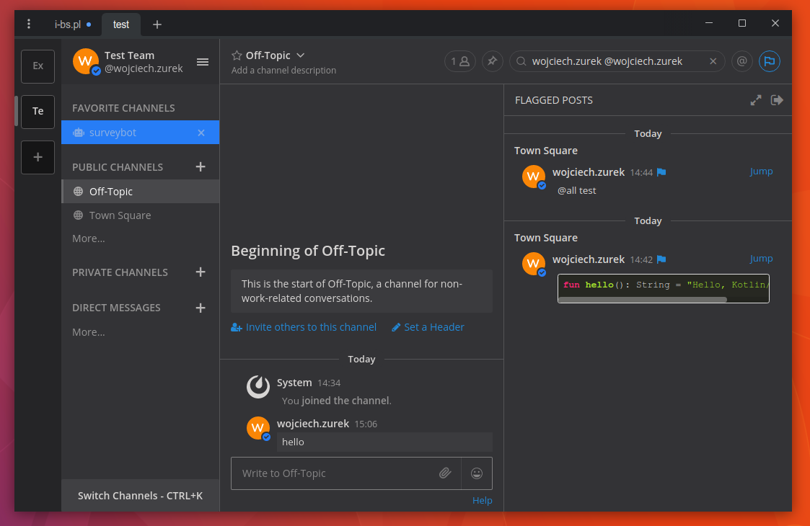

# The Mojave Dark Mattermost Theme

* Open Mattermost
* Account Settings
* Display
* Custom Theme
* Paste the code

```json
{"sidebarBg":"#333336","sidebarText":"#d7d5d4","sidebarUnreadText":"#d7d5d4","sidebarTextHoverBg":"#277df6","sidebarTextActiveBorder":"#666668","sidebarTextActiveColor":"#ffffff","sidebarHeaderBg":"#2e2e31","sidebarHeaderTextColor":"#d7d5d4","onlineIndicator":"#277df6","awayIndicator":"#e0b333","dndIndicator":"#f74343","mentionBj":"#ffffff","mentionColor":"#ffffff","centerChannelBg":"#333336","centerChannelColor":"#d7d5d4","newMessageSeparator":"#f80","linkColor":"#2389d7","buttonBg":"#26a970","buttonColor":"#ffffff","errorTextColor":"#fd5960","mentionHighlightBg":"#fff2bb","mentionHighlightLink":"#2f81b7","codeTheme":"monokai","mentionBg":"#277df6"}
```

* Save

# Screenshot


